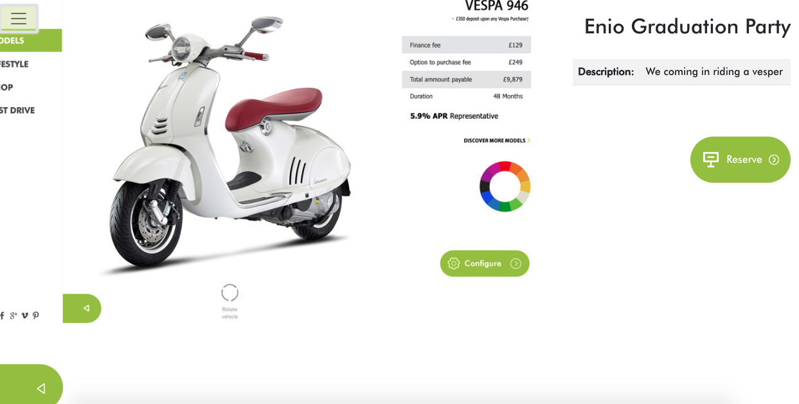
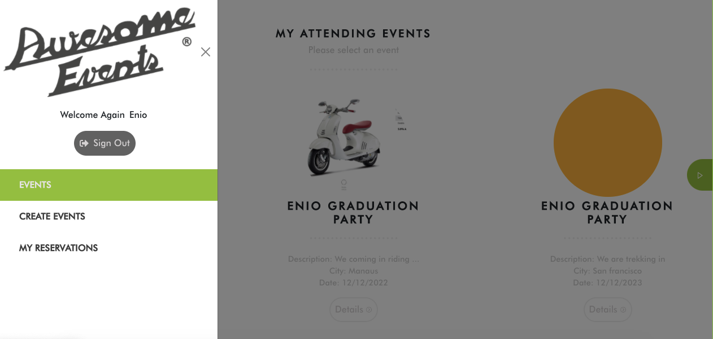

# Awesome Events (Front-End)!

## About

The main goals for this exercise are:

- Implement a connection between a Ruby on Rails back-end and ReactJS front-end.
- Understand the pros and cons of different approaches of connecting Ruby on Rails back-end with ReactJS front-end.

## Live Version
- Front-End [Hosted on Netlify](https://awesome-events.netlify.app)
- Back-End [Hosted on Heroku](https://awesome-events-back-end.herokuapp.com/)

In this project, only the ReactJS front-end part was implemented. The back-end part of the project can be found in [this repo](https://github.com/aristides1000/awesome-events-back-end).

- Below screenshots of the app are presented:

- Welcome Page: 

> 

- Details Page: 

> 

- Events Page:

> 

- Navigation Panel:

> 

## Built With

- ReactJS, Redux
- Jest and React Testing Library
- VisualStudio Code, Git, & GitHub
## Pre-requisites

- NodeJs (v. 14.17)
- YarnJs (v. 1.22.10)
- Git

## Getting Started

1. In your terminal, in the folder of your preference, type the following bash command to clone this repository:

```sh
git clone git@github.com:enionsouza/awesome-events-front-end.git
```

2. Now that you have already cloned the repo run the following commands to get the project up and running:

```sh
cd hello-react-front-end
yarn
npx browserslist@latest --update-db
```

3. Now, on your terminal, run:

```sh
yarn start
```

- This should start your local server in [http://localhost:4200/](http://localhost:4200/). Now, you can go to your browser and visit this page, but for this app to execute properly, you need to set up the back-end part (API) which can be found in [this repo](https://github.com/aristides1000/awesome-events-back-end).

- To stop the server, hit `<CTRL> + C` on your keyboard.

## Run tests

To test the App's components and logic, please, run the following command:

```sh
yarn test
```
*** When the tests are finished, just hit `q` key to leave the watch mode for the tests. ***

## Authors
- 3 people participated in this project:

👨‍💻 **Arístides José Molina Pérez**

- GitHub: [@aristides1000](https://github.com/aristides1000)
- Twitter: [@aristides_1000](https://twitter.com/@aristides_1000)
- LinkedIn: [aristides jose molina perez](https://www.linkedin.com/in/aristides-molina/)

👨‍💻 **Ênio Neves de Souza**

- GitHub: [@enionsouza](https://github.com/enionsouza)
- Twitter: [@enionsouza](https://twitter.com/enionsouza)
- LinkedIn: [Enio Neves de Souza](https://www.linkedin.com/in/enio-neves-de-souza/)

  
👨‍💻 **Daniel Samuel**

- Github: [DanSam5k](https://github.com/DanSam5k)
- Twitter: [@_dan_sam](https://twitter.com/_dan_sam)
- Linkedin: [dansamuel](https://www.linkedin.com/in/dansamuel/)

## 🤝 Contributing

Contributions, issues and feature requests are welcome!

Feel free to comments and raise any [issue](https://github.com/enionsouza/awesome-events-front-end/issues) for this milestone.

## Show your support

Give a ⭐️ if you like this project!

## Acknowledgments
- Hat tip to anyone whose code was used 🔰
- Inspiration 💘
- Microverse program ⚡
- Our standup team 🏹
- Our family's support 🙌

## 📝 License

This project is [MIT](https://opensource.org/licenses/MIT) licensed.


